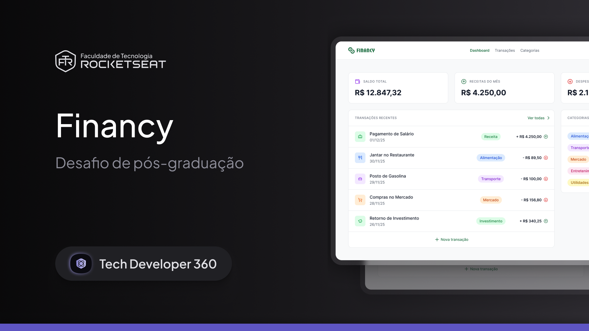

<p align="center">
  
</p>

# 💰 Financy

<p align="center">
  <strong>Gestor financeiro pessoal para organização de transações e categorias</strong>
</p>

## 📋 Sobre o Projeto

O **Financy** é um site desktop de organização de finanças, com gestão completa de transações e categorias. A aplicação permite controlar receitas e despesas de forma intuitiva, facilitando o acompanhamento da saúde financeira pessoal.

### 🎓 Desafio Tech Developer 360

Este projeto foi desenvolvido como desafio prático do curso de pós-graduação **Tech Developer 360**, um dos conteúdos disponíveis para alunos da **Faculdade de Tecnologia Rocketseat**.

## ✨ Funcionalidades

- 📊 **Dashboard Financeiro**: Visualização de saldo total, receitas e despesas do mês
- 💸 **Gestão de Transações**: Cadastro, edição e exclusão de transações financeiras
- 🏷️ **Categorias**: Organização por categorias personalizadas (Alimentação, Transporte, Mercado, etc.)
- 📈 **Transações Recentes**: Listagem das últimas movimentações financeiras
- 🎨 **Interface Moderna**: Design limpo e intuitivo com tema customizado

## 🛠️ Tecnologias

- **[Angular](https://angular.dev/)** - Framework front-end
- **[PrimeNG](https://primeng.org/)** - Biblioteca de componentes UI
- **[TypeScript](https://www.typescriptlang.org/)** - Linguagem de programação
- **[Vitest](https://vitest.dev/)** - Framework de testes

## 🚀 Como Executar

### Pré-requisitos

- Node.js 18+
- npm 11+

### Instalação

```bash
# Clone o repositório
git clone https://github.com/ricardobelfort/financy-manager-app.git

# Entre na pasta do projeto
cd financy-manager

# Instale as dependências
npm install
```

### Executando o Projeto

```bash
# Inicie o servidor de desenvolvimento
npm start

# A aplicação estará disponível em http://localhost:4200
```

### Outros Comandos

```bash
# Build de produção
npm run build

# Executar testes
npm test

# Build em modo watch
npm run watch
```

## 📁 Estrutura do Projeto

```
financy-manager/
├── src/
│   ├── app/
│   │   ├── app.config.ts      # Configurações da aplicação
│   │   ├── app.routes.ts      # Rotas da aplicação
│   │   ├── theme-preset.ts    # Tema customizado PrimeNG
│   │   └── app.ts             # Componente principal
│   ├── styles.css             # Estilos globais
│   └── index.html             # HTML principal
├── public/                    # Arquivos públicos
├── angular.json               # Configurações do Angular
├── package.json               # Dependências do projeto
└── tsconfig.json             # Configurações TypeScript
```

## 🎨 Design System

O projeto utiliza uma paleta de cores customizada:

- **Brand**: `#1F6F43` (Verde escuro) e `#124B2B` (Verde muito escuro)
- **Feedback**: `#EF4444` (Danger), `#19AD70` (Success)
- **Grayscale**: De `#111827` a `#F8F9FA`

## 📝 Licença

Este projeto foi desenvolvido como parte de um desafio educacional da Rocketseat.

---

<p align="center">
  Desenvolvido com 💚 por <a href="https://github.com/ricardobelfort">Ricardo Belfort</a>
</p>

<p align="center">
  <strong>Faculdade de Tecnologia Rocketseat</strong><br>
  Tech Developer 360
</p>
